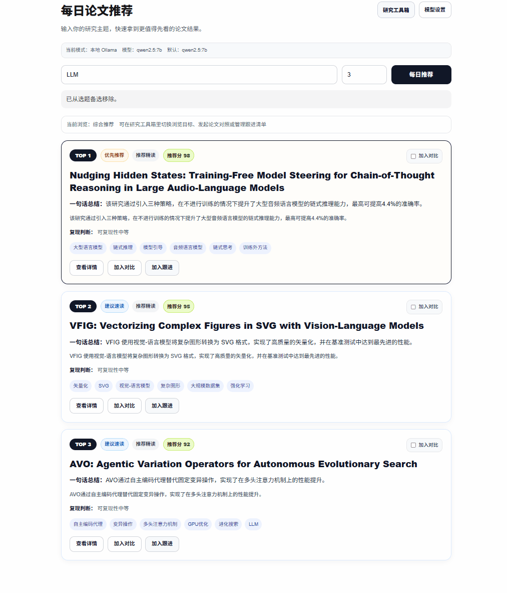
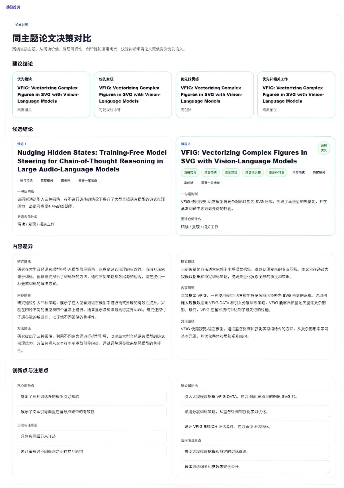
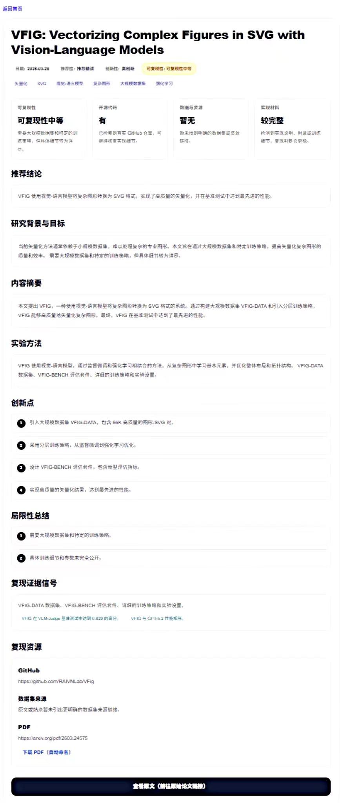
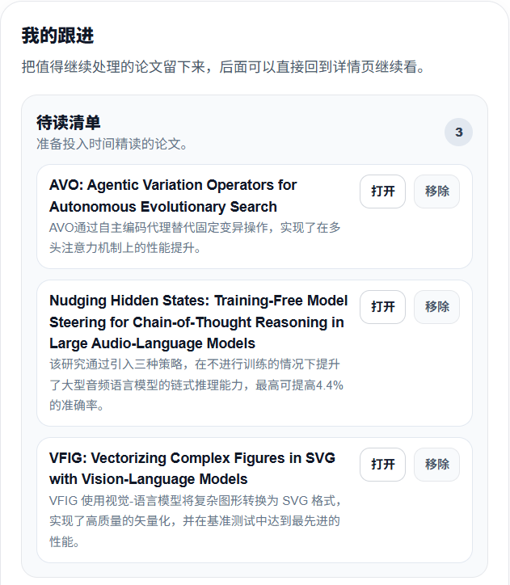
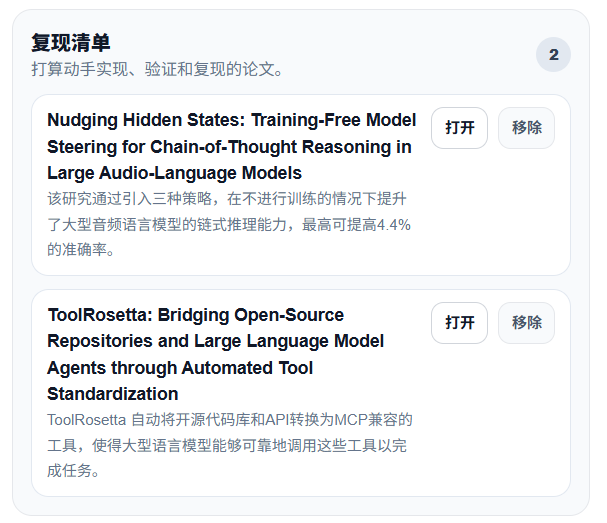
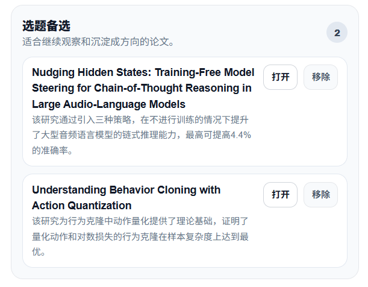

# PaperPilot

[](https://nextjs.org/)
[](https://fastapi.tiangolo.com/)
[](https://www.docker.com/)
[](#quick-start)

> Stop scrolling paper feeds. Start making better reading decisions.

PaperPilot is an AI research assistant that helps you decide what to read next.

> Demo mode lets you preview the full product without an API key or a local model. Start with LLM, RAG, CoT, Reasoning, or Multimodal. For real topic search and live analysis, switch to your own API key or a local Ollama model.

Instead of showing another long paper list, it helps you:

- rank papers within the same topic
- compare candidate papers side by side
- understand which paper deserves deeper attention first
- keep important papers in a follow-up workflow

It is built for researchers who want to read, reproduce, or track the right papers - not just collect more of them.

## What is PaperPilot?

PaperPilot turns paper discovery into reading decisions.

Most paper tools help you find papers.
PaperPilot helps you decide what to do with them.

It is designed for questions like:

- Which paper should I read first?
- Which one is more worth reproducing?
- Which papers should I keep tracking?
- Which candidate is the best fit for my current topic?

## Core capabilities

- ranked recommendations within the same topic
- side-by-side paper comparison
- decision-friendly paper detail pages
- follow-up workflows for papers worth reading later

## Workflow-friendly details

- clean PDF filenames with paper titles and dates
- downloaded papers stay easier to search and manage locally
- built for real research workflows, not just paper browsing

## Demo

See the full product flow below:



## Product Tour

### 1. Ranked Recommendations

The homepage turns a topic into a ranked list with recommendation scores, one-sentence takeaways, and compact action buttons.


### 2. Decision Comparison

Instead of showing a flat list of papers, PaperPilot helps users judge which candidate deserves deeper attention first.



### 3. Detail Analysis

Each paper has a decision-friendly detail page with recommendation conclusion, background, summary, method, innovation, limitations, and reproducibility evidence.



### 4. Follow-Up Workflow

Users can keep papers for reading, reproduction, or topic tracking instead of losing them after one browse session.

<p align="center">
  
  
  
</p>

## Why PaperPilot?

Most tools help you search papers.
PaperPilot helps you make reading decisions.

Instead of only listing papers, it helps you:

- rank papers under the same topic
- compare multiple candidates before reading deeply
- keep useful papers in a follow-up workflow
- manage downloaded PDFs with readable filenames based on titles and dates

## Product Highlights

### 1. Daily Topic-Based Recommendations

- search by research topics such as `CoT`, `LLM`, `RAG`, `Multimodal`, or `Reasoning`
- get ranked paper cards instead of a raw feed
- each card shows a one-sentence takeaway and compact tags
- recommendation scores are visible as a product surface, while ranking is driven by same-topic relative comparison
- supports multiple research goals such as deep reading, reproduction, inspiration, and related work review

### 2. Decision-Friendly Detail Pages

- recommendation conclusion
- background and goal
- summary and method notes
- reproducibility evidence
- cleaner resource presentation
- normalized PDF download naming for easier local storage

### 3. Paper Comparison

- compare 2 to 3 papers under the same topic
- quickly judge which one deserves time first
- useful for reading, reproduction, inspiration, and related work decisions
- pushes the product beyond paper discovery into research decision support

### 4. My Follow-Ups

- save papers into reading list
- save papers into reproduction list
- save papers into topic candidate list
- persist follow-up items in the backend database
- keep the workflow alive after discovery

## Quick Start

This repo is optimized for the lightest onboarding path first.

### What you actually need

Running the app and using the core recommendation features are two different things:

- `Docker` runs the frontend and backend services
- `A model provider` powers recommendation, analysis, comparison, and follow-up reasoning

That means:

- `Docker + built-in demo mode` = the app starts and shows a full product preview immediately
- `Docker + your own API key` = recommended public path, easiest for most users
- `Docker + local Ollama model` = also works, but setup is heavier

### Fastest first look: Docker + built-in demo mode

If you just want to preview the product before preparing any model access, this is now the easiest path.

You need:

- Docker Desktop

You do **not** need:

- an API key
- Ollama
- a local model
- Node.js
- Python

Run:

```bash
docker compose up --build
```

Then open the app and keep the default `PaperPilot Demo / no setup` preset.

For the clearest first preview, start with one of these demo topics:

- `LLM`
- `RAG`
- `CoT`
- `Reasoning`
- `Multimodal`

This mode is best for:

- quick first try
- screenshots and demos
- GitHub visitors who want to see the product before deploying a real model path

Tradeoffs:

- uses built-in sample recommendations instead of live model analysis
- great for product preview, not for evaluating real daily recommendation quality

Important:

- demo mode is meant for first-time preview and GitHub visitors
- it can show the full product workflow without any API key
- demo mode is optimized for preview topics such as `LLM`, `RAG`, `CoT`, `Reasoning`, and `Multimodal`
- for other topics, demo mode still shows the interface and sample workflow, but it is not a live topic-specific analysis path
- if you want broader topic coverage, real-time recommendation generation, and real analysis results for your own searches, you still need either your own API key or a local Ollama model

### Recommended path: Docker + your own API key

This is the best choice for most users.

You do **not** need:

- Ollama
- a local 7B model download
- Node.js
- Python

You **do** need:

- Docker Desktop
- your own API key from `DeepSeek`, `Kimi`, `Qwen`, or another OpenAI-compatible provider

Run:

```bash
docker compose up --build
```

Then open:

- Frontend: [http://localhost:3000](http://localhost:3000)
- Backend docs: [http://localhost:8000/docs](http://localhost:8000/docs)

Inside the app:

1. Open `Model Settings`
2. Choose `DeepSeek`, `Kimi`, `Qwen`, or another OpenAI-compatible API
3. Paste your own API key
4. Enter a topic like `CoT`, `LLM`, `RAG`, `Reasoning`, or `Multimodal`
5. Start using the product

Why this path is recommended:

- lowest deployment friction
- no local model download
- better cross-platform experience
- easiest path for GitHub visitors

Tradeoffs:

- requires your own API key
- depends on external model service availability
- model usage costs depend on your provider

In practice, for lightweight daily recommendation usage such as Top 3 or Top 5 searches, API usage is usually modest. The actual cost still depends on your provider, model choice, and how often you search.

### If you do not have your own API key

You can still use the built-in demo mode for a full product preview.

If you want real recommendation and analysis results without an API key, your alternative is:

- install `Ollama`
- pull a local model
- run the app with local inference

This works, but it is a heavier setup than the default public path.

## Deployment Modes

### 1. Demo / preview mode

Best for:

- first-time visitors
- quick product preview
- screenshots, GIFs, and demos
- users who want to try the interface before setting up any model access

Requirements:

- Docker

Pros:

- zero model setup
- zero API key requirement
- fastest way to see the full UI and workflow

Cons:

- returns built-in sample recommendations
- not suitable for evaluating live recommendation quality

Recommendation:

- use this as the first experience path for GitHub visitors

### 2. Public / lightweight mode

Best for:

- first-time users
- GitHub visitors
- demos
- cross-platform onboarding

Requirements:

- Docker
- your own API key

Pros:

- easiest setup
- no local model download
- works better across Windows and macOS

Cons:

- requires an API key
- depends on third-party model services

Recommendation:

- this should be the default real-use path for most users after they try demo mode

### 3. Advanced local mode

Best for users who explicitly want local inference and do not want to rely on an external API.

Requirements:

- Docker
- Ollama
- a local model such as `qwen2.5:7b`

Example:

```bash
ollama pull qwen2.5:7b
```

Then use:

- provider: `ollama`
- model: `qwen2.5:7b`
- base URL: `http://localhost:11434`

Pros:

- no external API key required
- more private local usage

Cons:

- heavier setup
- local model download is large
- slower or harder for first-time users

Recommendation:

- use this only if you specifically want local inference

### 4. Development mode

Use this only if you want to edit the code.

This mode is intentionally not the primary public onboarding path.

#### Windows

Frontend:

```bash
cd paper-reader-ui
start_frontend.bat
```

Backend:

```bash
cd paper-reader-v1
start_backend.bat
```

#### macOS / Linux

Frontend:

```bash
cd paper-reader-ui
./start_frontend.sh
```

Backend:

```bash
cd paper-reader-v1
./start_backend.sh
```

Notes:

- `.bat` files are Windows-only convenience scripts
- `.sh` files are for macOS/Linux
- if you only want to try the product, prefer Docker instead of local development

## Tech Stack

### Frontend

- Next.js
- TypeScript

### Backend

- FastAPI
- SQLite

### Model Layer

- OpenAI-compatible API providers
- optional Ollama local inference

## Why SQLite First

This project is intentionally kept lightweight for:

- demos
- GitHub sharing
- local product showcase
- fast first deployment

Advanced users can later replace it with an external database if they want larger-scale persistence.

See:

- [`paper-reader-v1/.env.example.txt`](./paper-reader-v1/.env.example.txt)

## Repo Structure

```text
paper-project/
|- README.md
|- LICENSE
|- .gitignore
|- docker-compose.yml
|- docs/
|- paper-reader-ui/
|- paper-reader-v1/
`- paper-reader skill/
```

## Open Source Goal

This repo is not just a code dump. It is intended to show product thinking:

- ranking instead of raw listing
- decision support instead of paper collection
- follow-up workflow instead of one-time browsing
- deployability instead of environment-heavy prototypes
- practical PDF saving instead of messy download clutter

## License

MIT
