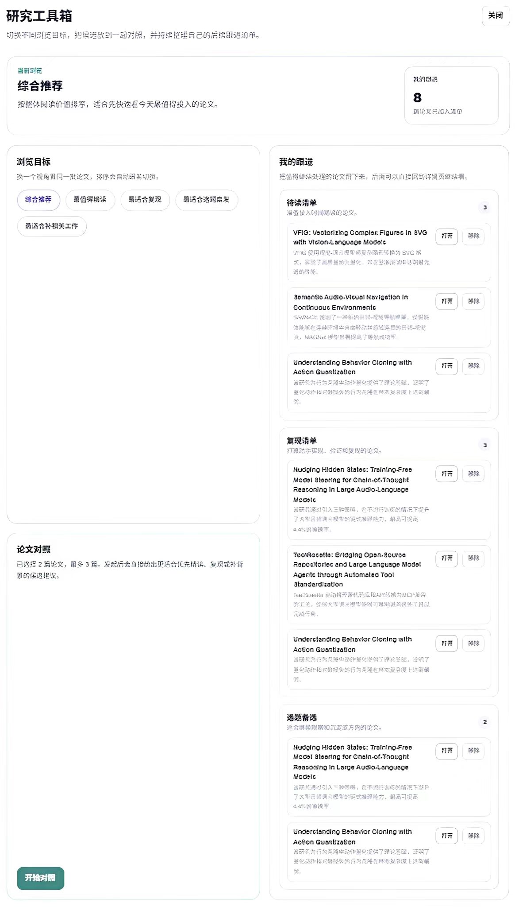

# PaperPilot

> Stop scrolling paper feeds. Start making better reading decisions.

[](https://nextjs.org/)
[](https://fastapi.tiangolo.com/)
[](https://www.docker.com/)
[](#quick-start)

PaperPilot is an AI paper recommendation and decision assistant for researchers.

Instead of showing a raw list of papers, it helps users answer the questions that actually matter:

- Which paper should I read first?
- Which one is worth deeper attention?
- Which one is more realistic to reproduce?
- Which one should I save for follow-up later?

It turns a research topic into:

- ranked recommendations
- one-sentence takeaways
- decision-friendly detail pages
- side-by-side paper comparison
- follow-up lists for reading, reproduction, and topic tracking
- automatically renamed PDF downloads for cleaner storage

## Product Tour

### 1. Ranked Recommendations

The homepage turns a topic into a ranked list with recommendation scores, one-sentence takeaways, and compact action buttons.


### 2. Decision Comparison

Instead of showing a flat list of papers, PaperPilot helps users judge which candidate deserves deeper attention first.


### 3. Detail Analysis

Each paper has a decision-friendly detail page with recommendation conclusion, background, summary, method, innovation, limitations, and reproducibility evidence.


### 4. Follow-Up Workflow

Users can keep papers for reading, reproduction, or topic tracking instead of losing them after one browse session.



## Why It Stands Out

- It recommends instead of merely listing papers.
- It ranks papers inside the same topic instead of treating every paper as equal.
- It helps users compare candidates before investing reading time.
- It supports follow-up workflows instead of one-time browsing.
- It automatically renames downloaded PDFs, making long-term storage and retrieval much easier.
- It is designed like a product, not just a crawler or course demo.

## Product Highlights

### 1. Daily Topic-Based Recommendations

- search by research topics such as `CoT`, `LLM`, `RAG`, `Multimodal`, or `Reasoning`
- get ranked paper cards instead of a raw feed
- each card shows a one-sentence takeaway and compact tags
- recommendation scores are visible as a product surface, while ranking is driven by same-topic relative comparison
- supports multiple research goals such as deep reading, reproduction, inspiration, and related work review

### 2. Decision-Friendly Detail Pages

- recommendation conclusion
- background and goal
- summary and method notes
- reproducibility evidence
- cleaner resource presentation
- normalized PDF download naming for easier local storage

### 3. Paper Comparison

- compare 2 to 3 papers under the same topic
- quickly judge which one deserves time first
- useful for reading, reproduction, inspiration, and related work decisions
- pushes the product beyond paper discovery into research decision support

### 4. My Follow-Ups

- save papers into reading list
- save papers into reproduction list
- save papers into topic candidate list
- persist follow-up items in the backend database
- keep the workflow alive after discovery

## Quick Start

This repo is optimized for the lightest onboarding path first.

### Recommended path: Docker + your own API key

You do **not** need Ollama, a local model download, Node.js, or Python just to try the product.

Run:

```bash
docker compose up --build
```

Then open:

- Frontend: [http://localhost:3000](http://localhost:3000)
- Backend docs: [http://localhost:8000/docs](http://localhost:8000/docs)

Inside the app:

1. Open `Model Settings`
2. Choose `DeepSeek`, `Kimi`, `Qwen`, or another OpenAI-compatible API
3. Paste your own API key
4. Enter a topic like `CoT`, `LLM`, `RAG`, `Reasoning`, or `Multimodal`
5. Start using the product

This is the default public onboarding path.

## Deployment Modes

### Public / lightweight mode

Best for first-time users.

- Docker
- your own API key
- no Ollama required
- no local model download required

### Advanced local mode

Best for users who explicitly want local inference.

Optional:

```bash
ollama pull qwen2.5:7b
```

Then use:

- provider: `ollama`
- model: `qwen2.5:7b`
- base URL: `http://localhost:11434`

### Development mode

Use this only if you want to edit the code.

Frontend:

```bash
cd paper-reader-ui
npm install
npm run dev
```

Backend:

```bash
cd paper-reader-v1
py -3.11 -m venv .venv
.venv\Scripts\activate
pip install -r requirements.txt
python -m uvicorn app.main:app --reload --host 0.0.0.0 --port 8000
```

## Media Files

Place your screenshots under `docs/assets/` with these filenames:

```text
docs/assets/homepage.jpg
docs/assets/detail-page.jpg
docs/assets/compare-page.jpg
docs/assets/follow-up.jpg
```

If you want to use a GIF, you can replace one of the screenshots with:

```text
docs/assets/demo.gif
```

## Tech Stack

### Frontend

- Next.js
- TypeScript

### Backend

- FastAPI
- SQLite

### Model Layer

- OpenAI-compatible API providers
- optional Ollama local inference

## Why SQLite First

This project is intentionally kept lightweight for:

- demos
- GitHub sharing
- local product showcase
- fast first deployment

Advanced users can later replace it with an external database if they want larger-scale persistence.

See:

- [`paper-reader-v1/.env.example.txt`](./paper-reader-v1/.env.example.txt)

## Repo Structure

```text
paper-project/
|- README.md
|- LICENSE
|- .gitignore
|- docker-compose.yml
|- docs/
|- paper-reader-ui/
|- paper-reader-v1/
`- paper-reader skill/
```

## Open Source Goal

This repo is not just a code dump. It is intended to show product thinking:

- ranking instead of raw listing
- decision support instead of paper collection
- follow-up workflow instead of one-time browsing
- deployability instead of environment-heavy prototypes
- practical PDF saving instead of messy download clutter

## License

MIT
